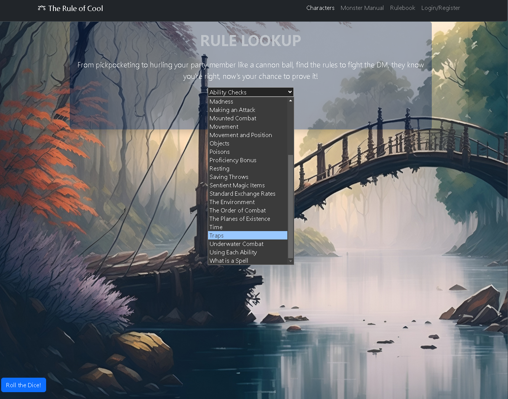
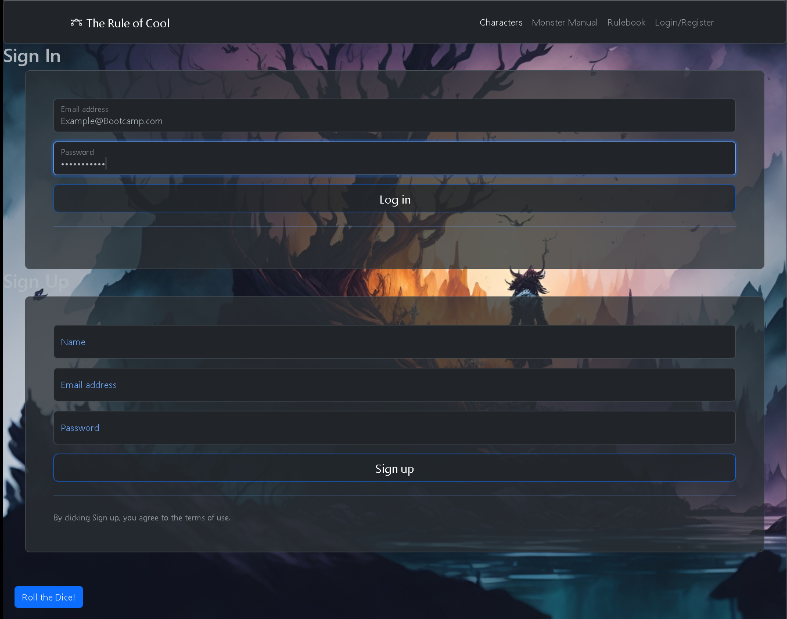

# The Rule of Cool
 
 ## Badges

## Description
This site allows you to create dnd characters, look up rules, and even monsters.

## Table of Contents
- [Description](#description)
- [Installation](#installation)
- [Usage](#usage)
- [Credits](#credits)
- [License](#license)
- [Badges](#badges)
- [Features](#features)
- [Tests](#tests)
- [Questions](#questions)

## Installation
This site can be accessed at: https://rule-of-cool-779c8e563c30.herokuapp.com/
Github site: https://github.com/Jlevbury/Full-Circle

## Usage
You can create and store multiple characters after logging in with an account. The monster and rule lookup do not require a login.

## Credits
Chase Chambers, James Levesque, Owen Warner, classwork, Questions answered by Luis Quicano and Mo Ager.

## License

This project is covered under the MIT License

## Features
Account Creation
Character storage
Rule Lookup
Monster Lookup

## How to Contribute
N/A

## Tests
Creating and deleting characters, adding items, spells, features, changing proficiency levels, and deleting items from the character

## Questions
https://github.com/chasechambers
https://github.com/jlevbury
https://github.com/owenwar

We can be reached via e-mail at:
Chase - chambers.chase@gmail.com
James -jlevesque1985@gmail.com
Owen - owenwarner11@gmail.com